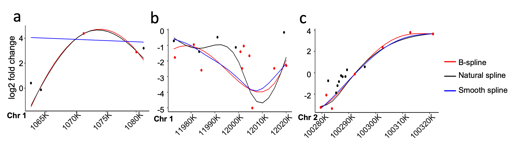

```{r, echo=FALSE, include=FALSE}
knitr::opts_chunk$set(
  collapse = TRUE,
  error = FALSE,
  warning = FALSE, 
  message = FALSE,
  cache = FALSE,
  comment = "#>",
  dev="png"
)
```

# Introduction

Super enhancers (SEs) are broad enhancer domains usually containing multiple constituent 
enhancers that hold elevated activities in gene regulation. Disruption in one or more 
constituent enhancers causes aberrant SE activities that lead to gene dysregulation in 
diseases. To quantify SE aberrations, differential analysis is performed to compare SE
activities between cell conditions. The state-of-art strategy in estimating differential 
SEs relies on overall activities and neglect the changes in length and structure of SEs. 
DASE uses a weighted spline model to identify differential SEs between two conditions by 
accounting for the combinatorial effects of constituent enhancers weighted with their 
activities and locations (internal dynamics). In addition to overall changes, our method 
finds four novel types (shortened, shifted, hollowed and other complex scenarios) of 
differential SEs pointing to the structural differences within SEs.

# Getting Started

Load the package in R

```{r library}
library(DASE)
```

# Preparing Inputs

DASE requires the following input files:

  1. Enhancer BED file: a merged enhancer BED file including the enhancers (e.g. H3K27Ac sequencing peaks)
     from all compared samples.
  1. SE BED file: a merged SE BED file including the SE regions from all compared samples.
  1. Coverage files: either the path of BAM/BigWig files for each condition and replicate, or a sequencing 
     count table for all enhancers across conditions and replicates.

Below are the examples of the enhancer and SE BED files, following the UCSC definition 
(https://genome.ucsc.edu/FAQ/FAQformat.html).

### *Enhancer BED file*

The enhancer BED file can be of any table formats as long as  the first 6 columns contain
the information of "chromosome","start","end","name","score" and "strand". Here is an example of 
BED files with only 6 columns.

```{r enhancer_data}
# load enhancer BED file
enhancer_path <- system.file("extdata","enhancer.bed",package="DASE")
enhancer_region <- read.table(enhancer_path,sep="\t",header=F)
head(enhancer_region)
```

### *SE BED file*

The SE BED file can be of any formats as long as the first 6 columns contain the information of
"chromosome","start","end","name","score",and "strand". Here is an example of BED files with only 6 columns.

```{r SE_data}
# load SE BED file
se_path <- system.file("extdata","SE.bed",package="DASE")
se_region <- read.table(se_path,sep="\t",header=F)
head(se_region)
```

# Basic Usage of _DASE_

In this section, we use DASE to find differential SEs by comparing SE profiles on **chromosome 21** between
two cancer cell lines (K562 and MCF7). Here, we focus on the basic usage of running DASE with different
coverage input files (BAM, BigWig, and enhancer raw count table). By default, DASE will run permutations
to determine a significant threshold to aid the defining of different SE categories. Additional options,
such as blacklist region removal and running without permutation can be found later in the "Additional 
Options" section.

### *Run DASE with BAM or BigWig coverage files*

This section demonstrates _DASE_ with BAM or BigWig input files. The BAM or BigWig files are used to estimate 
the reads counts of enhancers in different samples. _DASE_ uses *featureCounts* to count the enhancer abundance 
from BAM files or uses *rtracklayer* for BigWig files. The first step is to get the paths of all BAM or BigWig 
files for each sample. Then, with the specified enhancer and SE regions, we can run _DASE_ as follow 
(Here we use BigWig files as an example).

```{r DASE2}
# path of BigWig file for each condition
s1_r1_bw <- system.file("extdata","K562_1_chr21.bw",package="DASE")
s1_r2_bw <- system.file("extdata","K562_2_chr21.bw",package="DASE")
s2_r1_bw <- system.file("extdata","MCF7_1_chr21.bw",package="DASE")
s2_r2_bw <- system.file("extdata","MCF7_2_chr21.bw",package="DASE")

# running DASE with BigWig files
DASE_out <- DASE(se_in=se_region,e_in=enhancer_region,data_type = "bw",
                 s1_r1_bam=s1_r1_bw,s1_r2_bam=s1_r2_bw,
                 s2_r1_bam=s2_r1_bw,s2_r2_bam=s2_r2_bw)

```

### *Run DASE with enhancer raw count table*

This section demonstrates DASE with enhancer raw count table. Instead of count enhancer reads from BAM or 
BigWig files, the function adapts count table directly to save time and space. The format of count table 
is shown below. The first column must be the enhancer name with "chr_start_end" format. The count table is adapted with parameter *enhancer_count_table*.

```{r DASE3}
# read enhancer count table
enhancer_count_path <- system.file("extdata","chr21_enhancer_count.txt",package="DASE")
enhancer_count <- read.table(enhancer_count_path,sep="\t",header=T)
head(enhancer_count)

# run DASE
DASE_out_count <- DASE(se_in=se_region,e_in=enhancer_region,
                 enhancer_count_table=enhancer_count)

```

### *Run DASE with different spline functions*

_DASE_ uses spline functions to fit log2 fold change values of constituent enhancers between conditions.
We chose to implement 3 widely-adapted spline functions (b-spline, natural spline, and smooth.spline) 
in _DASE_ to provide flexibility, although we only reported results from b-splines in our manuscript 
due to its superiority in practice. _DASE_ uses b-spline as default. The three functions provide similar
 results overall. However, they could have very different performance in some cases. The examples below 
show a brief comparison between  spline functions.

{width=80%}

Smooth spline performs badly on SEs with a small number of constituent enhancers (fitting points) (Figure 1a). 
When there are more number of data points (usually larger than 6), all spline functions show similar performance
(Figure 1c). However, in practice, natural splines might overfit when regression weights are considered based 
on our algorithms (Figure 1b). Note that we implement a strategy to control overfitting with b-spline 
(see our manuscript).

Users can chose different spline functions  with *spline_fun* parameter in "DASE". 
Following are some examples of run _DASE_ with different spline functions.

```{r DASE4}
# rund DASE with b-spline function (default)
DASE_out_bs <- DASE(se_in=se_region,e_in=enhancer_region,
                 enhancer_count_table=enhancer_count,permut=F)

# run DASE with natural spline function
DASE_out_ns <- DASE(se_in=se_region,e_in=enhancer_region,
                 enhancer_count_table=enhancer_count,permut=F,
                 spline_fun = "ns")

# run DASE with smooth spline function
DASE_out_smooth <- DASE(se_in=se_region,e_in=enhancer_region,
                 enhancer_count_table=enhancer_count,permut=F,
                 spline_fun = "smooth")
```

```{r, spline_fig,fig.show = "hold",fig.width=10,fig.height=4,fig.align="center",out.width="80%"}
# spline fitted plots of different spline functions
library(gridExtra)
grid.arrange(DASE_out_bs$pattern_list[[7]],
             DASE_out_ns$pattern_list[[7]],
             DASE_out_smooth$pattern_list[[7]],nrow=1)
```

Left is b-spline; middle is natural spline; right is smooth spline.

# Interpretation of _DASE_ Outputs

The output of _DASE_ is a list with multiple data types including:

  1. lfc_shrink: a shrinking lfc object from _DESeq2_ for all enhancers. It can be used to creat MA plot.
  1. cutoff: significant threshold for fitted log2 fold changes.
  1. density_plot: a density plot of permutation and original fitted log2 fold changes, if *permut=T*.
  1. boxplot: a boxplot of final SE categories.
  1. se_category: a data frame containing final SE categories.
  1. pattern_list: a list containing figures for each SE pattern.
  1. ce_fit: a data frame containing DESeq2 output and spline-fitted log2 fold change of all constitute enhancers.

  
### *Significant threshold*
We use permutation of spline fitted log2 fold changes to decide the significant threshold. Under 
default settings, _DASE_ will run permutation 10 times with *SEpermut* function. If permutation is 
disabled, the default significant threshold is -1 and 1. Users can also choose their own thresholds with 
*cutoff_v* parameter. Please refer to the  *Additional options* section for this.

```{r threshold}
# Significant threshold
DASE_out_count$cutoff
```

```{r, density_plot,fig.show = "hold",fig.width=4,fig.height=4,fig.align="center",out.width="90%"}
# Permutation density plot
DASE_out_count$density_plot
```

Black dash lines indicate the thresholds which are obtained based on the inflection points of the 
permutation distribution.

### *Super-enhancer internal dynamic categories*

*SE_category, pattern_list, ce_fit* are the outputs related to SE internal dynamics.

```{r se_cat_out}
# se_categories
head(DASE_out_count$se_category)
```

Each column represents the following:

  1. se_merge_name: name of merged SE,"chr_start_end".
  1. total_width: width of merged SE (unit=k).
  1. number_enhancer: number of CEs in each SE.
  1. category: SE category identified by _DASE_.
  1. direction: enrichment direction of SEs (none:Other or non-differential category; +: enriched in sample 2; -: enriched in sample 1; l:  sample 1 shifted in 5' direction; r: sample 2 shifted in 5' direction).
  1. non_mid_percent: percentage of non middle segments.
  1. mean_FC: mean of log2 SE coverage fold change.
  1. rank: SE category ranking based on non_mid_percent first and mean_FC for each SE category. (rank=1 means the most like to the SE category.)

```{r, pattern_example,fig.show = "hold",fig.width=4,fig.height=3,fig.align="center",out.width="80%"}
# an example of one sample
DASE_out_count$pattern_list[[1]]
```

This figure shows the constituent enhancer patterns within a SE example which is identified as *shortened*. 
Black line is the fitted log2 fold change curve; dots indicate constituent enhancers. Red dots indicate 
the constituent enhancers with heavy weights.
  
```{r se_fit}
# example of ce_fit
head(DASE_out_count$ce_fit)
```

Columns from "e_merge_name" to "width" indicate the property of each CEs. Columns from "S1_r1" to "S2_r2_norm" indicate the coverage of each CE in each sample. Columns from "baseMean" to "pvalue" indicate the results of _DESeq2_. Columns from "baseMean_shrink" to "padj_shrink" indicate _DESeq2_ shrinkage value. Please refer to _DASE_ help for more information.

# Additional Options
In addition of default parameters, _DASE_ can exclude the ENCODE blacklist regions from consideration. 
_DASE_ can also adapt an user-define blacklist region with *custom_range* parameter. We have included 
the human blacklist region file from ENCODE (accession ID: ENCFF356LFX) in our package.

```{r blacklist}
# blacklist file
blacklist_path <- system.file("extdata","region_blacklist.bed",package="DASE")
blacklist_region <- read.table(blacklist_path,sep="\t",header=F)
head(blacklist_region)
```

There is also an option to opt-out permutation calculation. The default setting of DASE will run 
permutation 10 times. Users can turn it off with *permut=F*. When there is no permutation, the default 
thresholds are -1 and 1, or users can choose the thresholds they like with *cutoff_v* parameter. 
However, defining customized thresholds are only available under *permut=F*. 

### *DASE with enhancer blacklist region*
Example of using blacklist option. 
```{r blacklist_run}
# run DASE with blacklist file and customized region
DASE_out_bl <- DASE(se_in=se_region,e_in=enhancer_region,bl_file = blacklist_region,
                 custom_range = c("chr21:14735763-29634779","chr21:33539902-43710703"),
                 enhancer_count_table=enhancer_count)

```

Users can find that the number of SEs (i.e. 8) in "DASE_out_bl" is less than that in "DASE_out_count" 
which is calculated without blacklist region (i.e. 34).

### *DASE with no permutation*
Two examples of different permutation options. 

```{r permut_1}
# run DASE with permutation 3 times
DASE_out <- DASE(se_in=se_region,e_in=enhancer_region,times=3,
                 cutoff_v = c(-2,2),enhancer_count_table=enhancer_count)
```

```{r no_permut}
# run DASE wit customized threshold
DASE_out_p <- DASE(se_in=se_region,e_in=enhancer_region,permut = F,
                 cutoff_v = c(-3,3),enhancer_count_table=enhancer_count)
```

```{r, permutation_example,fig.show = "hold",fig.width=8,fig.height=4,fig.align="center",out.width="80%"}
# boxplots of different threshold
library(gridExtra)
grid.arrange(DASE_out_count$boxplot,
             DASE_out_p$boxplot,nrow=1)

```

By comparing results based on different threshold cutoffs, the right plot (with larger threshold cutoff) 
identified  more SEs in the *similar* category than the left plot (with smaller threshold cutoff).

# Citation
Please cite our paper when using DASE: [https://www.biorxiv.org/content/10.1101/2021.09.25.461810] 

